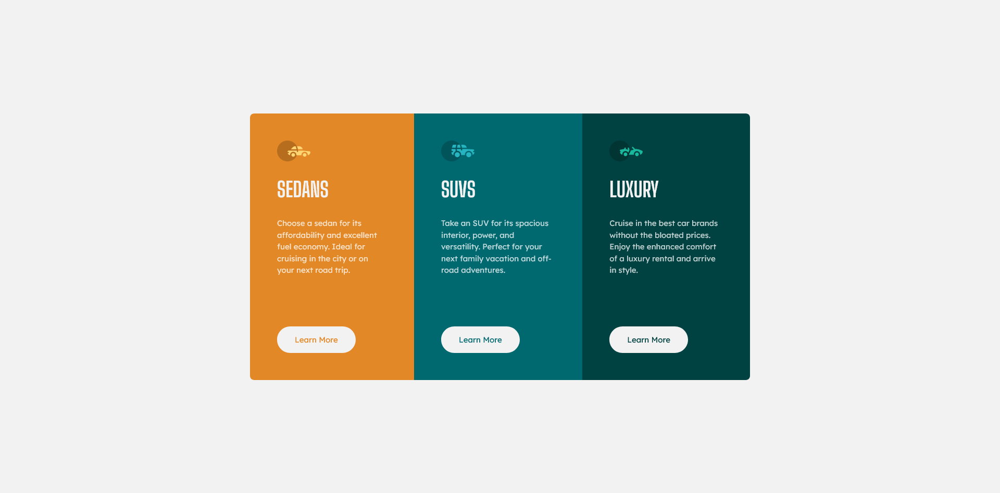

# Frontend Mentor - 3-column preview card component solution

This is a solution to the [3-column preview card component challenge on Frontend Mentor](https://www.frontendmentor.io/challenges/3column-preview-card-component-pH92eAR2-). Frontend Mentor challenges help you improve your coding skills by building realistic projects. 

## Table of contents

- [Overview](#overview)
  - [The challenge](#the-challenge)
  - [Screenshot](#screenshot)
  - [Links](#links)
- [My process](#my-process)
  - [Built with](#built-with)
  - [What I learned](#what-i-learned)
  - [Useful resources](#useful-resources)
- [Author](#author)

## Overview

### The challenge

Users should be able to:

- View the optimal layout depending on their device's screen size
- See hover states for interactive elements

### Screenshot

### Links

- Solution URL: [GitHub](https://github.com/mbdelarosa/3-column-preview-card-component)
- Live Site URL: [3-column Preview Card Component](https://mbdelarosa.github.io/3-column-preview-card-component/)

## My process

### Built with

- Semantic HTML5 markup
- CSS custom properties
- Flexbox
- Mobile-first workflow
- BEM naming convention

### What I learned

Learnings from this challenge:
- Getting used to writing BEM class names
- Using the `align-self: start` property to stop the flex item from taking up the whole available width
	- Used on the SVG images and the Learn More buttons
- Adding an `aria-label` on the anchor tags to describe the purpose of the Learn More links (from the [WCAG 2.2 Techniques](https://www.w3.org/WAI/WCAG22/Techniques/aria/ARIA8))

### Useful resources

- ["How to Prevent Image Stretching With Flexbox" on TechStacker](https://techstacker.com/how-to-prevent-image-stretching-with-flexbox/) - This helped explain the default behavior of Flexbox on images (or any flex item) and provided a simple solution to modify this to prevent unwanted stretch

## Author

- Frontend Mentor - [@mbdelarosa](https://www.frontendmentor.io/profile/mbdelarosa)
